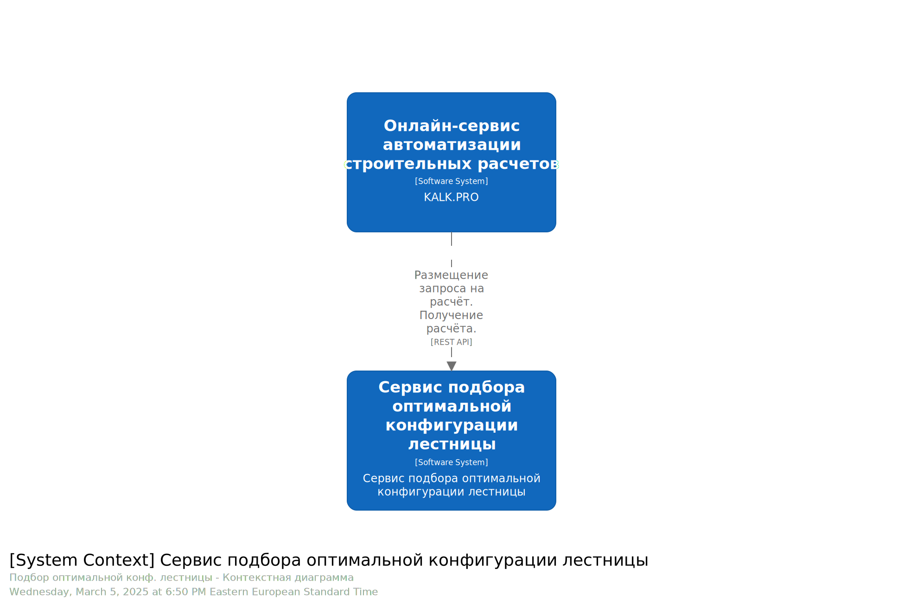
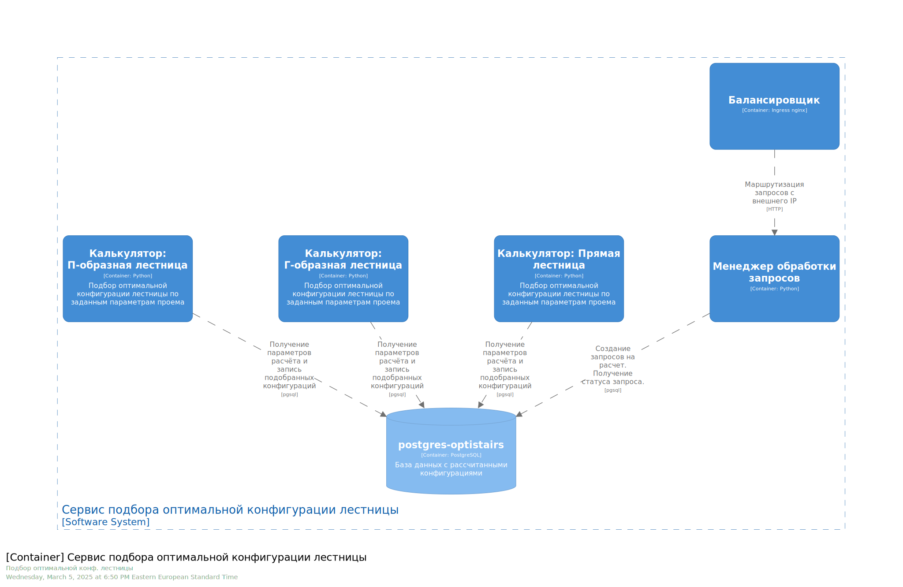
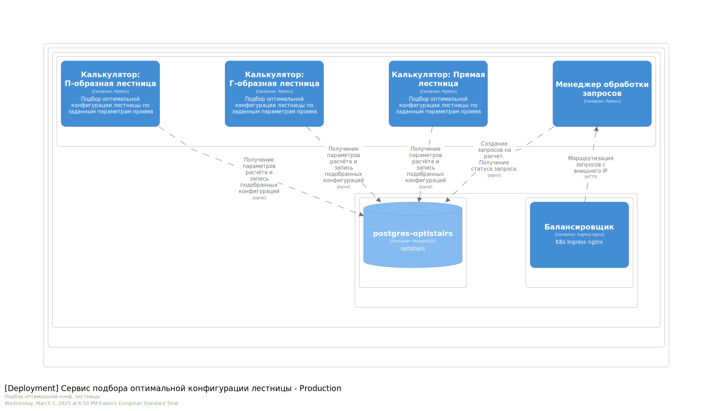
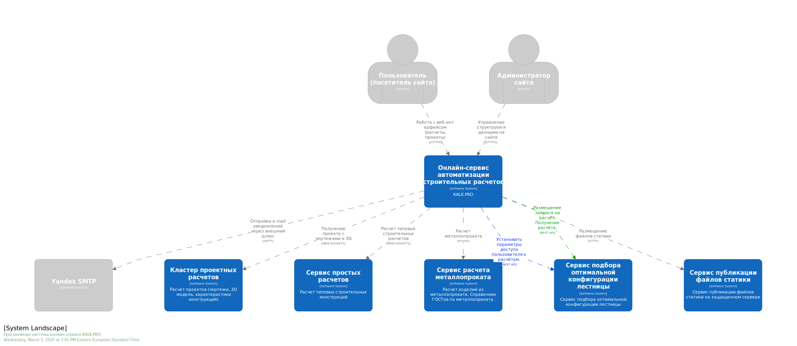

# ФС Подбор оптимальной конфигурации лестницы
___

# Содержание
* [Глоссарий](#глоссарий)
* [Бизнес-контекст](#бизнес-контекст)
* [Бизнес-цели](#бизнес-цели)
* [Бизнес-драйверы](#бизнес-драйверы)
* [Целевая аудитория](#целевая-аудитория)
* [Конкуренция](#конкуренция)
  * [Русскоязычные сервисы](#русскоязычные-сервисы)
  * [Англоязычные сервисы](#англоязычные-сервисы)
  * [Специализированные сервисы](#специализированные-сервисы)
  * [Дополнительные возможности](#дополнительные-возможности)
* [Регулирование](#регулирование)
  * [Российские нормативные документы](#российские-нормативные-документы)
  * [DIN (немецкие стандарты)](#din-немецкие-стандарты)
  * [Дополнительные документы](#дополнительные-документы)
  * [Основные параметры по СНиП](#основные-параметры-по-снип)
* [Технологический ландшафт](#технологический-ландшафт)
* [Финансовые ограничения](#финансовые-ограничения)
* [Стейкхолдеры и их потребности](#стейкхолдеры-и-их-потребности)
* [User Story](#user-story)
  * [Постановка](#постановка) 
  * [Описание](#описание) 
  * [Миссия](#миссия) 
  * [Критерии приемки](#критерии-приемки) 
  * [Дополнительные сведения](#дополнительные-сведения) 
* [User cases (упрощенный вариант)](#user-cases-упрощенный-вариант)
  * [Работа с основным интерфейсом онлайн-сервиса](#работа-с-основным-интерфейсом-онлайн-сервиса)
  * [Выбор критериев удобства лестницы](#выбор-критериев-удобства-лестницы)
  * [Работа с интерфейсом приложения подбора оптимальной конфигурации лестницы](#работа-с-интерфейсом-приложения-подбора-оптимальной-конфигурации-лестницы)
  * [Работа с результатами подбора](#работа-с-результатами-подбора)
  * [Переход на страницу основного интерфейса онлайн-сервиса для работы с проектом лестницы](#переход-на-страницу-основного-интерфейса-онлайн-сервиса-для-работы-с-проектом-лестницы)
  * [Платный функционал](#платный-функционал)
  * [Задачи для реализации исполнения критериев приемки (верхне-уровневые топики)](#задачи-для-реализации-исполнения-критериев-приемки-верхне-уровневые-топики)
* [Критические сценарии и критические характеристики](#критические-сценарии-и-критические-характеристики)
* [Реестр архитектурных решений](#реестр-архитектурных-решений)
  * [ADR-001 Технологический стек Frontend веб-приложения для ФС](#adr-001-технологический-стек-frontend-веб-приложения-для-фс)
  * [ADR-002 Выбор инфраструктуры для разработки новых приложений при рефакторинге ФС Кластера проектных расчетов](#adr-002-выбор-инфраструктуры-для-разработки-новых-приложений-при-рефакторинге-фс-кластера-проектных-расчетов)
  * [ADR-003 Технологический стек Backend веб-приложения для ФС](#adr-003-технологический-стек-backend-веб-приложения-для-фс)
  * [ADR-004 Отмена "комбинированного" варианта backend-приложения подбора оптимальных конфигураций лестницы (отмена ADR-003)](#adr-004-отмена-комбинированного-варианта-backend-приложения-подбора-оптимальных-конфигураций-лестницы-отмена-adr-003)
  * [TODO: ADR-005 Авторизация запросов](#adr-005-авторизация-запросов)
  * [TODO: ADR-006 CORS для REST API запросов в Kubernetes с frontend-приложения](#adr-006-cors-для-rest-api-запросов-в-kubernetes-с-frontend-приложения)
  * [TODO: ADR-007 Определение "Функциональный сервис"](#adr-007-определение-функциональный-сервис)
* [Системная архитектура C4](doc/c4_sys.md/#системная-архитектура-c4-назначение-и-зона-ответственности-программных-систем)
  * [Системная архитектура C4. Назначение и зона ответственности программных систем.](doc/c4_sys.md/#системная-архитектура-c4-назначение-и-зона-ответственности-программных-систем)
  * [Запуск STRUCTURIZR](doc/c4_structurizr.md/#запуск-structurizr)
* [Спецификация OpenAPI для разработки функционала подбора оптимальных конфигураций лестницы](#спецификация-openapi-для-разработки-функционала-подбора-оптимальных-конфигураций-лестницы)

# Глоссарий
* **3D модель** - трех-мерная модель конструкции и отдельных ее элементов, построенная на базе математической модели.
* **CSS** (англ. Cascading Style Sheets «каскадные таблицы стилей») — формальный язык декорирования и описания внешнего вида документа (веб-страницы), написанного с использованием языка разметки (чаще всего HTML или XHTML). Также может применяться к любым XML-документам, например, к SVG или XUL.
* **Веб (WEB или Всемирная паутина)** — это система взаимосвязанных гипертекстовых документов и мультимедийных ресурсов, доступных через интернет. Пользователи могут просматривать эти документы с помощью веб-браузеров, переходя по гиперссылкам между страницами.
* **Веб-браузер** - программа работающая на персональном устройстве пользователя, предоставляющая доступ к веб-интерфейсу онлайн-сервиса.
* **Веб-интерфейс** - пользовательский интерфейс, который предоставляет доступ к функциональности веб-приложений через веб-браузер. Он позволяет пользователям взаимодействовать с серверными программами для ЭВМ и выполнять различные операции с помощью графических элементов.
* **Веб-страница** - отдельный документ, доступный в интернете, который может содержать текст, изображения, видео и другие элементы мультимедиа. Веб-страницы создаются с использованием языка разметки HTML и могут быть статическими (неизменяемыми) или динамическими (изменяемыми в зависимости от пользовательского ввода или других факторов).
* **Дата-центр** - специализированное помещение или комплекс, предназначенный для размещения серверов и компьютерного оборудования, используемого для обработки, хранения и передачи данных.
* **Зона ответственности сервиса** - конкретный набор функций и задач, за которые сервис отвечает. Зона ответственности включает в себя управление данными, выполнение операций и взаимодействие с другими сервисами. Она помогает определить границы сервиса и его независимость, обеспечивая четкое разграничение обязанностей между различными компонентами системы.
* **Интерфейс пользователя**, он же пользовательский интерфейс (UI — англ. user interface) — интерфейс, обеспечивающий передачу информации между пользователем-человеком и программно-аппаратными компонентами компьютерной системы (ISO/IEC/IEEE 24765-2010).
* **Критерии удобства** - такие параметры лестницы, которые отвечают за удобство ее эксплуатции. Критерии удобства могут незначительно отличаться в зависимости от сферы применения лестницы: в частном доме, на чердак или парадная. К критериям удоства можно отнести такие параметры как: высота подъема ступени, глубина шага ступени, высота свободного пространства над лестницей, свес ступени, ширина марша лестницы, значение формулы Блонделя.
* **Ключевые параметры** - параметры вводимые пользователем через веб-интерфейс, набор которых влияет на итоговые характеристики лестницы. К таким параметрам можно отнести: форму лестницы, длину марша лестница, высоту лестницы, ширину марша, количество ступеней лестницы, расположение последней верхней ступени к уровню второго этажа.
* **Контракт** - формальное соглашение, определяющее правила и схему взаимодействия между различными системами, сервисами и микросервисами. Контракты описывают, какие данные должны отправляться и приниматься, а также условия, при которых взаимодействие происходит, включая ожидаемые форматы данных, методы и протоколы.
* **Коэффициент комфорта** - рассчитывается как произведение коэффициентов соответствия критериям удобства. Может принимать значения от 0 до 1. Значения равные нулю, соответствуют конфигурациям, которые абсолютно неудобны и должны быть исключены из результатов. Значения коэффициента комфорта больше нуля представляют возможные конфигурации лестницы. Чем ближе больше значение коэффициента (ближе к 1), тем больше лестница соответствует, выбранным критериям удобства и тем более оптимальной является ее конструкция для проема с указанными параметрами.
* **Коэффициент соответствия критериям удобства** - показывает на сколько, выбранный параметр рассчитанной конфигурации лестницы соответствует допустимому диапазону значений, указанному пользователем для этого параметра в критериях удобства. Рассчитывается для диапазона критерия удобства следующим образом:
  * В диапазоне от def_min до def_max, коэффициент принимает значение равное 1.
  * Для значений параметра меньше min или большее max, коэффициент принимает значение 0.
  * Для значений параметра в диапазоне от min до def_min, коэффициент рассчитывается как 1 - (def_min - value) / (def_min - min)
  * Для значений параметра в диапазоне от max до def_max, коэффициент рассчитывается как 1 - (value - def_max) / (max - def_max)
* **Лестница** - строительная конструкция для обеспечения удобного перемещения между разными по высоте уровнями здания, например, для подъема с первого на второй этаж. Лестницы бывают различной формы: прямые, Г-образные, П-образные, Z-образные, винторвые, могут содержать не только прямые, но и забежные ступени. Конструктивно могут быть исполнены из дерева, металла или бетона. Отдельные узлы и элементы могут быть выполнены по разным технологиям: лестницы на косоурах, лестницы на тетивах, на монокосоуре и т.д.
* **Операционная система** - это набор программного обеспечения, который управляет аппаратными ресурсами компьютера и предоставляет услуги для запуска приложений. Операционная система служит связующим звеном между аппаратным обеспечением и пользователем, позволяя выполнять задачи, такие как управление файлами, обработка ввода-вывода и управление памятью.
* **Опыт пользователя, восприятие пользователя, опыт взаимодействия** (англ. User eXperience, UX) — восприятие и ответные действия пользователя, возникающие в результате использования и/или предстоящего использования продукции, системы или услуги (ISO 9241-210)
* **Онлайн-расчет** - расчет по заданным пользователем критериям через веб-интерфейс. Расчет осуществляется безотлагательно программой для ЭВМ, результат расчета передается пользователю так быстро как быстро могут завершиться операции вычислений для этого расчета. Обычно время расчета столь мало (менее 30 секунд), что позволяет удержать пользователя на странице сайта с веб-интерфейсом до момента завершания расчета.
* **Онлайн-сервис автоматизации строительных расчетов** - программно-аппаратный комплекс запрограммированный на расчет заданных строительных конструкций. Включает в себя набор программ для ЭВМ, размещенных на серверах в дата-центре, взаимодействующих между собой по определенным контрактам, в результате исполнения которых пользователь получает быстрый онлайн-расчет по заданным начальным критериям. Результат расчета пользователь получает через веб-интерфейс программы для ЭВМ.
* **Онлайн-сервис автоматизации строительных расчетов** - программы для ЭВМ с веб-интерфейсом, предоставляющие пользователю получать онлайн-расчеты по типовым строительным расчетам.
* **Оптимальная конфигурация** - такая конфигурация лестницы, ограниченной заданными размерами проема, которая обеспечит максимальное удобство ее использования.
* **Назначение сервиса** - краткое описание основной функции или цели сервиса. Оно объясняет, что сервис делает и какую задачу он решает в рамках системы. Назначение определяет роль сервиса в архитектуре и его вклад в бизнес-процессы.
* **Пользователь** - человек, который взаимодействует с программой для ЭВМ через веб-интерфейс.
* **Проект** - набор чертежей, 3D модель, схемы, списки материалов и их характеристик, отображаемых в веб-интерфейсе для пользователя по результатам онлайн-расчета. Проект может быть выгружен в виде графических, текстовых файлов и объектных файлов для их дальнейшего использования пользователем.
* **Программ для ЭВМ** - набор структурированного программного кода, содержащего заранее определенные алгоритмы, способные к запуску и исполнению внутри операционной системы, и выполняющий заданные автоматические функции. (Википедия: Совокупность программ, данных и инструкций, которые обеспечивают выполнение определенных задач на электронно-вычислительных машинах).
* **Программная система** - Комплекс из одно или более программ для ЭВМ, обеспечивающих функциональность системы в рамках назначения и зоны ответственности ее компонентов.
* **Проем** - свободное пространство выделенное для расположения лестницы, ограниченное высотой между уровнем полов нижнего и верхнего уровней, формой и размерами отверстия в междуэтажном перекрытии, а также доступным пространством на нижнем уровне для размещения лестницы.
* **Страница сайта** — это отдельный документ, доступный через Всемирную паутину (WEB), который может содержать текст, изображения, видео, аудио и другие элементы мультимедиа. Страницы сайтов создаются с использованием языков разметки, таких как HTML, и могут быть динамическими или статическими.
* **Фреймворк** — программная платформа, определяющая структуру программной системы; программное обеспечение, облегчающее разработку и объединение разных компонентов большого программного проекта.
* **Функциональный сервис** - (ФС), программная система выполняющая отведенную ей функциональную роль в рамках контекста заданного процесса. Может состоять из одного и более сервисов или микро-сервисов, позволяющих организовать заданную функциональность программной системы.
* **Чертежи** - проекции трех-мерной модели конструкции и ее отдельных элементов на двух-мерную плоскость в разных проекциях с вынесением размерных линий. Чертежи предоставляют пользователю полное описание о размерах и форме конструкции для того, чтобы пользователь мог самостоятельно изготовить интересующую его конструкцию.

# Бизнес-контекст
Компания Калк.Про представляет онлайн-сервис автоматизации строительных расчетов. Одно из направлений автоматизации - проектирование лестниц для частных домов. На основании, задаваемых пользователем параметров лестницы, сервис предоставляет проект - 3D модель лестницы и ее конструктивных элементов, чертежи и характеристики конструкции. Для работы с расчетом, от пользователя требуются понимание базовых знаний математики и принципов расчета ключевых параметров лестницы. Чтобы получить необходимую конфигурацию лестницы, пользователю нужно совершить итерацию расчетов и не факт, что полученная конфигурация будет оптимальной.

# Бизнес-цели
Бизнес компании Калк.Про принял решение внедрить сервис автоматического подбора оптимальной конфигурации лестницы. Новый сервис должен решить следующие цели:
* Повысить конверсию на 30% за счет упрощения сценария взаимодействия с интерфейсом расчета лестницы.
* Увеличить долю постоянных пользователей проекта - лестничные компании, за счет предоставления инструмента быстрого подбора оптимальной конфигурации лестницы по запросу клиента.
* Уменьшить процент отказов на 20% у новых пользователей онлайн-сервиса за счет упрощения взаимодействия пользователя с онлайн-сервисом, сведя к минимуму необходимый набор входных данных для расчета к набору размеров проема под лестницу пользователя.

# Бизнес-драйверы
* Инновационный метод подбора оптимальной конфигурации лестницы.
* Рост спроса на проектирование лестницы в частном строительстве.
* Увеличение количества конкурентов, перекрывающих поисковую выдачу по тематике расчета лестниц.

# Целевая аудитория
Интернет пользователи (77% - мужчины, 23% - женщины)
Основной возраст аудитории 25 - 55 лет
Основные интересы - Строительство, обустройство и ремонт

# Конкуренция
## Русскоязычные сервисы:
* Zhitov.ru (Расчёт лестницы)
* Calcstroy.ru (Расчёт лестницы)
* Lestnn.ru (Расчёт лестницы)
* Staircount.ru (Расчёт лестницы)
* Constructor.stolyarych.ru (Конструктор лестницы)
* Stairshop.pro (Конструктор лестницы)

## Англоязычные сервисы:
* Omni Calculator (Stair Calculator)
* Blocklayer.com (Stairs Layout)
* Calconic.com (Staircase Calculator)
* Staircalcs.com
* Decks.com (Stair Calculator)
* Mycarpentry.com (Stair Calculator)
* Buildster.com (Stair Calculator)
* Metricstaircalculator.com
* Stairmakeronline.com
* Estimator.org (Stair Calculator)

## Специализированные сервисы:
* 3D Stair Builder (позволяет создавать 3D модели лестниц)
* SmartDraw (включает шаблоны для проектирования лестниц)
* SketchUp (есть плагины для расчета лестниц)
* Homestyler (интерьерный дизайнер с функцией создания лестниц)

## Дополнительные возможности:
* Некоторые производители лестниц предлагают свои калькуляторы на сайтах
* В некоторых строительных магазинах есть онлайн-калькуляторы
* Существуют мобильные приложения для расчета лестниц

# Регулирование
Ниже приведен список основных документов, регламентирующих проектирование и строительство лестниц в частных домах:

## Российские нормативные документы:
### СНиП:
* СНиП 31-01-2003 "Жилые здания"
* СНиП 2.08.01-89* "Жилые здания"
* СНиП 2.03.11-85 "Стальные конструкции"

### ГОСТ:
* ГОСТ 23120-2016 Лестницы маршевые, площадки и ограждения стальные. Технические условия.
* ГОСТ Р 53254-2009 "Лестницы пожарные наружные стационарные"

### СанПиН:
* СанПиН 2.1.2.2645-10 "Санитарно-эпидемиологические требования к условиям проживания в жилых зданиях и помещениях"
* СанПиН 2.2.2948-11. Санитарно-эпидемиологические правила и нормативы"

## DIN (немецкие стандарты):
* DIN 18065:2017-02 "Лестницы, площадки и переходные мостики - Правила безопасности"
* DIN 18067-1:2018-08 "Лестницы для зданий и сооружений - Часть 1: Лестницы с горизонтальными ступенями"
* DIN 18067-2:2018-08 "Лестницы для зданий и сооружений - Часть 2: Наклонные лестницы"
* DIN 18067-3:2018-08 "Лестницы для зданий и сооружений - Часть 3: Винтовые лестницы"
* DIN 18067-4:2018-08 "Лестницы для зданий и сооружений - Часть 4: Лестницы с наклоном более 75°"

## Дополнительные документы:
* ФЗ-123 "Технический регламент о требованиях пожарной безопасности"
* СП 1.13130.2020 "Системы противопожарной защиты. Организация управления эвакуацией людей при пожаре"

## Основные параметры по СНиП:
* Угол наклона: 25-45° для маршевых лестниц
* Высота ступени: 15-19 см
* Ширина проступи: не менее 26 см
* Ширина марша: не менее 80 см
* Радиус поворота для винтовых лестниц: не менее 110 см

# Технологический ландшафт
Стек проекта определен на основании источника привлечения целевой аудитории - пользователи из результатов поиска в сети интернет; технологического наследия ранее разработанной части проекта; стека, который используют конкуренты; и из текущих требований к реализации сервиса расчета оптимальных конфигураций лестницы.
* Backend: K8s NodeJS (TS), PHP 7.4, Web-Sockets
* Frontend: HTML5, React, JavaScript, ThreeJS (WebGL)

# Финансовые ограничения
Участники проекта:
* Системный аналитик / архитектор проекта
* Программист Frontend
* Программист Backend
**Срок MVP** - 3 месяца
**Бюджет** - 1 000 000 руб.

# Стейкхолдеры и их потребности
## Бизнес-стейкхолдеры (CEO/CTO)
* **Затратность**: Система должна быть дешевой в эксплуатации.
* **Прибыльность**: Внедрение системы должно способствовать увеличению доходов.
* **Масштабируемость**: Архитектура должна позволять легко адаптироваться к размерам и расположению бизнеса.
* **Риск-менеджмент**: Для минимизации технических и финансовых рисков, система должна быть хорошо наблюдаемой, обладать высокой степенью отказоустойчивости и обладать функцией восстанавливаемости.
* **Сроки реализации**: Быстрый выход на рынок и высокая скорость поддержки изменений.

## Технические стейкхолдеры (разработчики/DevOps, тестировщики, IT-администраторы)
* **Простота реализации**: Архитектура должна быть понятной и удобной для разработки.
* **Поддерживаемость**: Система должна быть легко поддерживаемой и модифицируемой.
* **Производительность**: Оптимальное использование ресурсов для обеспечения высокой производительности.
* **Инструменты и технологии**: Использование современных технологий, с которыми команда знакома или может быстро обучиться. Использование общепринятых протоколов и форматов данных.
* **Интеграция**: Легкость интеграции с существующими системами и сервисами. Должна быть совместима с существующим легаси кодом онлайн-сервиса Kalk.Pro.
* **Инфраструктура**: Система должна разрабатываться с учетом ее использования в облачных сервисах для гибкости и автоматизации процессов разработки.

## Пользователи (посетители сайта с потребностью получения оптимальной конфигурации лестницы)
* **Удобство использования**: Максимальная простота использования системы (минимум параметров). Удобный адаптивный интерфейс, предоставляющий возможность работы с любым разрешением экрана.
* **Гибкость**: Возможность конфигурирования системы под потребности пользователя.
* **Надежность**: Минимум сбоев и простоя системы.
* **Безопасность**: Защита личных данных и конфиденциальной информации.
* **Производительность**: Быстрая работа системы без задержек.

## Регуляторы и законодательные органы (налоговая инспекция, Роскомнадзор, международные контролирующие органы)
* **Соблюдение нормативов**: Соответствие ГОСТам и СП (возведение строительных конструкций и сооружений, прочность конструкций, технические условия для лестниц в жилых помещениях). Соответствие GDPR, HIPAA, 152-ФЗ, 54-ФЗ.

##  Операционная команда (DevOps-инженеры, программисты поддержки)
* **Мониторинг и управляемость**: Возможность эффективно отслеживать работу системы и быстро реагировать на проблемы.
* **Автоматизация**: Автоматические процессы для минимизации ручного вмешательства.
* **Документация**: Четкая и подробная документация для облегчения обслуживания.

# User Story
### Постановка:
Как **пользователь** онлайн-сервиса, я хочу **вводить известные размеры проема** под лестницу и **предпочитаемую форму** лестницы, чтобы онлайн-сервис автоматически подбирал **оптимальную конфигурацию** лестницы, подходящую для данного проема.

### Описание:
#### Вариант №1
- **Кто**: Пользователь, планирующий установить лестницу в своем доме.
- **Что**: Пользователь хочет указать известные ему размеры проема и форму лестницы.
- **Зачем**: Чтобы получить проект оптимальной конфигурации лестницы, подходящей для его проема.
#### Вариант №2
- **Кто**: Пользователь, планирующий установить лестницу в своем доме.
- **Когда**: Хочет получить проект оптимальной конфигурации лестницы, подходящей для его проема.
- **Тогда**: Онлайн-сервис должен подобрать оптимальную конфигурацию лестницы по известным данным о проеме пользователя, предоставить пользователю рекомендации и ссылку на выбранный проект.

### Миссия:
Упростить взаимодействие пользователя с веб-интерфейсом, предлагая пользователю вводить только известные ему данные о проеме и форме лестницы. Предоставляя взамен, быстрый подбор оптимальных вариантов конфигураций лестниц, которые можно вписать в проем пользователя. Тем самым увеличивая конверсию и вовлеченность пользователя при работе с онлайн-сервисом.

### Критерии приемки:
1. Пользователь выбирает желаемую форму лестницы: Прямая, Г-образная, П-образная.
2. Пользователь выбирает из предложенного списка форму проема в междуэтажном перекрытии, которой схематично больше всего совпадает с формой проема в междуэтажном перекрытии пользователя.
3. Пользователь вводит известный ему набор параметров проема: размеры проема, высоту от пола первого этажа до пола второго этажа, толщину междуэтажного перекрытия, доступные размеры основания на полу первого этажа, где может быть размещена лестница.
4. Система предоставляет пользователю набор критериев удобства лестницы, которые пользователь может изменить под свои предпочтения в рамках допустимых значений.
5. Система автоматически подбирает оптимальные конфигурации лестниц, удовлетворяющие критериям удобства лестницы и введенным параметрам проема.
6. Система предоставляет список оптимальных конфигураций лестниц, которые можно вписать в заданный проем.
7. Пользователь может отсортировать предложенный список лестницы по параметрам, характеризующим будущую лестницу.
8. Пользователь имеет возможность выбрать понравившуюся конфигурацию лестницы.
9. При выборе оптимальной конфигурации лестницы в браузере открывается дополнительная вкладка с онлайн-расчетом выбранной лестницы.
10. Лестница отображается в виде 3D модели, а также предоставляются чертежи и характеристики конструкции.

### Дополнительные сведения:
- Упрощение интерфейса для ввода данных.
- Возможность доработки предложенных конфигураций на основе отзывов пользователя.
- Обеспечение полезных подсказок и инструкций по вводу данных, например графические схемы.

# User cases (упрощенный вариант)
## Работа с основным интерфейсом онлайн-сервиса
Пользователь, находясь на веб-странице онлайн-сервиса расчета лестницы, видит кнопку, баннер или другой заметный мотивирующий к действиям блок на веб-странице, который информирует и мотивирует пользователя ускорить процесс проектирования его будущей лестницы, предлагая сделать быстрый автоматический расчет конструкции за счет подбора оптимальной конфигурации лестницы по известным параметрам проема. При клике по мотивирующему блоку, запускается дополнительный компонент страницы - всплывающее окно с программой для подбора оптимальной конфигурации лестницы. Под блоком ввода параметров проема должны располагаться две кнопки "Критерии удобства" и "Рассчитать".
## Работа с интерфейсом приложения подбора оптимальной конфигурации лестницы
### Общие характеристики
Интерфейс приложения должен быть адаптивный - корректно отображаться на мобильных устройствах, планшетах и десктопах.
Окно приложения состоит из двух основных зон-колонок. Левая колонка, занимает 1\3 ширины экрана и содержит набор полей для ввода параметров проема. Правая колонка, занимает 2\3 ширины экрана и содержит графические схемы, которые описывают распложение и значение вводимых параметров в левой колонке.
Поверх основного окна приложения могут открывать дополнительные всплывающие окна, например, для ввода критериев удобства лестницы для вывода результатов подбора оптимальных конфигураций лестницы. Все линейные размеры указываются пользователем в миллиметрах. _"Пилотная" версия будет работать только с деревянными лестницами на косоурах, в дальнейшем функционал будет расширен на другие конструктивные варианты лестниц._
### Ввод параметров проема
Пользователь вводит параметры проема в левый блок основного экрана приложения, который содержит следующие поля
* Тип лестницы
    * Прямая
    * Г-образная
    * П-образная
* Форма проема
    * Прямоугольный (для Прямой, Г и П -образной лестниц)
    * Г-образный (для Г и П -образной лестниц)
    * Г-образный обратный (для П-образной лестницы)
* Длина проема (для Г-образных проемов будет две длины проема, чтобы описать размеры формы Г)
* Ширина проема
* Допустима длина по основанию
* Высота между этажами
* Высота потолка
* Толщина междуэтажного перекрытия (должна валидироваться при подтверждении расчета как разница между значениями "Высота между этажами" минус "Высота потолка")
### Выбор критериев удобства лестницы
Критерии удобства лестницы доступны после нажатия на кнопку "Критерии удобства". По нажатию, открывается всплывающее окно, которое можно закрыть крестиком в правом верхнем углу, либо сохранить измененные критерии удобства лестницы, либо сбросить критерии удобства лестницы в значения по умолчанию. 
Критерии удобства:
* Коэффициент удобства (min: 0, max: 1, def_min: 0.5, def_max_fixed: 1), как фильтр для выходного списка найденных конфигураций лестниц. Значение def_max_fixed - зафиксировано на единице. В результаты попадают конфигурации коэффициент удобства которых находится в диапазоне def_min - def_max_fixed.
* Высота подъема ступени (min: 130, max: 250, def_min: 150, def_max: 150)
* Глубина шага (min: 180, max: 310, def_min: 260, def_max: 260)
* Высота свободного пространства над лестницей (min: 1800, max: 2000, def_min: 1800, def_max: 2000)
* Свес ступени (min: 20, max: 60, def_min: 40, def_max: 40)
* Характеристика по формуле Блонделя (min: 500, max: 700, def_min: 600, def_max: 650)
* Ширина марша лестницы (min: 550, max: 2000, def_min: 900, def_max: 1000)
### Работа с результатами подбора
После ввода параметров проема, возможной корректировки критериев удобства лестницы, пользователь нажимает на кнопку Рассчитать. Прежде чем на сервер уйдет запрос на расчет, форма ввода параметров проема должна быть автоматически проверена на корректность введенных данных:
* Зависимость размеров друг от друга, это касается проверки разницы между высотой этажей и потолка, которая должна быть равна толщине междуэтажного перекрытия;
* Все введенные значения в поля - это целые положительные числа.
  После отправки запроса на подбор оптимальных конфигураций лестниц, пользователю должно отобразиться всплывающее информационно окно о процессе подбора возможных конфигураций лестниц, которое должно показывать пользователю оценочное время на подбор конфигураций, или информировать его о том, что процесс подбора производится и по окончанию расчета пользователь будет обязательно проинформирован.
  Результат расчета:
* Отсутствие подобранных конфигураций;
* Одна и более оптимальных конфигураций лестницы.
  Если подобрать оптимальные конфигурации не удалось, пользователю должно быть выведено соответсвующее информационное сообщение: "В проем с заданными параметрами не удалось подобрать лестницу, удовлетворяющую критериям удобства". 
  Если конфигурации лестниц были найдены, они должны быть отображены пользователю в виде списка вариантов. Каждый элемент списка должен быть представлен набором параметров:
* Коэффициент удобства
* Угол наклона
* Формула удобства
* Формула Блонделя
* Высота ступени
* Глубина ступени
* Количество ступеней
* Ширина лестницы
* Минимальная ширина косоура
  Интерфейс должен предусматривать возможность сортировки найденных конфигураций лестницы по всем выше перечисленным параметрам, как в сторону убывания, так и в сторону возрастания. По умолчанию, список сортируется по убыванию по параметру "Коэффициент удобства", т.е. сначала отображается конфигурация лестницы с максимальным коэффициентом удобства, далее варианты с более низким коэффициентом удобства.
### Переход на страницу основного интерфейса онлайн-сервиса для работы с проектом лестницы
У каждой найденной конфигурации лестницы должна быть кнопка для перехода на страницу основного интерфейса онлайн-сервиса в расчет лестницы с заданными парамерами из выбранной конфигурации. Основной интерфейс онлайн-сервиса должен предоставить проект лестниц по заданным критериям.
### Платный функционал
Первые 5-ть позиций найденных конфигураций лестниц, с максимальным коэффициентом удобства, скрывают значения "Высоты ступеней", "Глубины ступеней", "Количества ступеней", а кнопка перехода в основной интерфейс онлайн-сервиса должна быть отключена. Это ограничение снимается при покупке доступа к результатам расчета. При попытке нажать на кнопку перехода к проекту, пользователь должен получать уведомление о том, что данный функционал доступен по подписке и ссылку или сценарий для осуществления приобретения подписки (планируется количественный доступ, например, доступ на 5, 10, 100 автоматических подборов лестниц).

### Задачи для реализации исполнения критериев приемки (верхне-уровневые топики)
#### Задачи проектирования
* Определить границы приложения. Архитектура приложения (микросервиса).
* Описать схему взаимодействия приложения с уже существующими системами C4 L1.
* Описать схему взаимодействия контейнеров приложения C4 L2.
* Описать контракты взаимодействия между системами в Swagger/AsyncAPI.
* Описать контракты SPA + backend в Swagger.
* Создать и описать карточку микросервиса.
#### Задачи на Frontend
* Подготовить пространство проекта в GIT репозитории для SPA.
* Настроить автоматический CI\CD.
* Разработать SPA на React, в соответствии с UC и UserStory.
* Реализовать наличие платного функционала в результатах расчета.
* Интегрировать SPA в основной интерфейс онлайн-сервиса как дополнительное веб-приложение.
#### Задачи на Backend
* Подготовить пространство проекта в GIT репозитории для Backend приложения.
* Выделить namespace в K8s согласно схеме развертывания из C4 L1/L2 Deployment.
* Настроить автоматический CI\CD.
* Разработать backend приложения на TypeScript используя с учетом размещения в K8s.

# НФТ
* Интерфейс приложения должен быть реализован с возможностью поддержки i18n.
* Доступ к методам расчета должен быть кросс-доменным.
* Расчет должен осуществляться менее чем за 60 секунд, или обеспечивать механизм асинхронного уведомления пользователя о завершении расчета. Или пользователю должен отображаться прогресс-бар расчета с реальным отображением времени на расчет.

# Критические сценарии и критические характеристики
## Критические сценарии:
* Пользователь легаси онлайн-сервиса Kalk.Pro выбирает и запускает на сайте проекта веб-приложение для подбора оптимальной конфигурации лестницы.
* С помощью веб-приложения подбора оптимальной конфигурации лестницы, пользователь получает набор оптимальных конфигураций лестницы в режиме онлайн. На время ожидания подбора пользователь видит прогресс выполнения процесса подбора конфигураций.
* Пользователь оплачивает доступ для получения проекта наиболее подходящей для него лестницы.
## Критические характеристики:
* "Мягкая" интеграция веб-приложения с легаси архитектурой онлайн-сервиса Kalk.Pro.
* Время подбора оптимальных конфигураций лестницы не более 1 минуты.
## Техническое решение:
* Использовать фреймворк React для создания веб-приложения и его последующей интеграции в существующий интерфейс онлайн-сервиса Kalk.Pro в качестве отдельного, независимого модуля, осуществляющего двусторонний обмен с вычислительным сервером.
* Для двустороннего обмена между приложением подбора оптимальных конфигураций лестницы использовать легаси протокол - Web-Sockets.
* Для вычислительного сервера использовать микро-сервисную архитектуру, с возможностью автоматического масштабирования ресурсов - Kubernetes.

# Реестр архитектурных решений

## ADR-001 Технологический стек Frontend веб-приложения для ФС
#### Дата: 2025-02-22
#### Статус: Принято

### Критический сценарий
Пользователь легаси онлайн-сервиса Kalk.Pro выбирает и запускает на сайте проекта веб-приложение для подбора оптимальной конфигурации лестницы.

### Критические характеристики:
"Мягкая" интеграция веб-приложения с легаси архитектурой онлайн-сервиса Kalk.Pro.

### Контекст
В рамках исполнения критического сценария требуется разработать и внедрить новое веб-приложение на действующий легаси сайт онлайн-сервиса Kalk.Pro, которое будет реализовывать основной пользовательский сценарий (UC) по взаимодействую пользователя с функциональными возможностями ФС Подбор оптимальных конфигураций лестницы. При подборе технологического стека для разрабатываемого веб-приложения нужно учесть, что изменения в UI части сервиса Kalk.Pro должны быть минимальны. Минимальные изменения обеспечат сохранность существующего легаси кода, минимизируют или полностью предотвратят регресс-тестирование сценариев не связанных с UC разрабатываемого ФС. Что в свою очередь снизит стоимость внедрения и минимизирует риски повреждения уже существующего на сайте функционала.

### Артефакты проектирования UI
* [Основной интерфейс приложения (ввод размеров проема)](ui_design/opening_sizes_input.png)
* [Настройка критериев удобства лестницы](ui_design/convenience_criteria_input.png)
* [Вывод результатов подбора оптимальных конфигураций лестницы](ui_design/optimal_configurations_result.png)

### Рассматриваемые варианты решения
#### Использование backend-шаблонизатора легаси сайта + JS
Сайт онлайн-сервиса Kalk.Pro реализован на базе системы управления сайтом CMS - коробочное решение на PHP. CMS позволяет разрабатывать представления страниц сайта, отдельных компонентов UI сайта на основе PHTML-шаблонов. При запросе пользователем страниц сайта, соответствующий странице PHTML-шаблон динамически преобразуются в HTML-документ, к которому прикрепляются дополнительные ресурсы, в том числе JS-скрипты, обеспечивающие дополнительный функционал взаимодействия на стороне клиента. Для создания веб-приложения ФС Подбора оптимальных конфигураций лестницы, может быть использован подход с использованием PHTML-шаблонов и JS-скрипты для создания необходимого функционала и представления, заявленного в UC и Артефактах проектирования UI.
##### Плюсы решения
* Применяется нативная технология разработки UI, используемая на сайте Kalk.Pro, обеспечивающая полную совместимость с легаси кодом онлайн-сервиса.
* Низкий порог вхождения для команды поддержки проекта.
##### Минусы решения
* Для создания UI в рамках основного UC, потребуется написание объемного кода на JS.
* Добавление дополнительного кода в существующий набор PHTML-шаблонов потребует полного регресса в тестировании функционала сайта онлайн-сервиса Kalk.Pro, что ведет к удорожанию подхода.
* В случае рефакторинга сайта или при создании дополнительного сайта-сателлита с функциональностью подбора оптимальной конфигурации лестницы, разработанный в рамках PHTML-шаблонов UI будет непереносим. Потребуется повторная разработка.
* Специфический стек PHTML-шаблонов неизвестный широкому кругу разработчиков, усложняет поиск и подключение к проекту новых разработчиков.

#### Фреймворк React
Позволяет разрабатывать UI целиком или отдельные его части. Собирать итоговый HTML-файл с ресурсами в единый JS-build файл, который может быть подключен к сайту онлайн-сервиса Kalk.Pro в виде отдельного, независимого веб-приложения. UI на React может подгружаться и запускаться, только на определенных страницах сайт и при определенных условиях/событиях. Весь необходимый функционал и HTML представление UI части ФС Подбора оптимальных конфигураций лестницы представлен одним файлом на JS, который может быть подключен к сайту онлайн-сервиса как внешний ресурс.
##### Плюсы решения
* Подключение UI веб-приложения отдельным JS-build файлом на заданных страницах сайта.
* CSS-стили UI могут быть инкапсулированы внутри веб-приложения.
* Независимость и изоляция веб-приложения от основного сайта онлайн-сервиса.
* Взаимодействие между веб-приложением и сайтом онлайн-сервиса через внешние события.
* Отсутствие необходимости полного регресса функционала сайта онлайн-сервиса после подключения веб-приложения в силу изолированности кодовой базы сайта и веб-приложения. Как следствие - экономия времени и ресурсов на тестировании.
* Быстрая разработка UX любой сложности для UI средствами фреймворка React.
* Защита кода от копирования встроенными средствами React.
* Быстрое подключение к разработке новых разработчиков в силу большого сообщества разработчиков React. Разработка на React - "промышленный стандарт".
* Ранее реализованные веб-приложения для сайта онлайн-сервиса Kalk.Pro были разработаны на базе React, сайт уже содержит событийный интерфейс взаимодействия с такими веб-приложениями. 
##### Минусы решения
* Более высокий порог включения для специалистов технического сопровождения проекта.

#### Фреймворк Vue
Аналогично React (в контексте аспектов принятия решения для ФС Подбора оптимальных конфигураций лестницы).
##### Плюсы решения
* Аналогично React (в контексте аспектов принятия решения для ФС Подбора оптимальных конфигураций лестницы).
##### Минусы решения
* Ранее на сайте онлайн-сервиса не внедрялись веб-приложения написанные на Vue.
* Приложение на Vue увеличит "зоопарк" стеков, которые нужно будет сопровождать в рамках проекта онлайн-сервиса.

### Принятое решение
Использовать фреймворк React для создания веб-приложения и его последующей интеграции в существующий интерфейс сайта онлайн-сервиса Kalk.Pro в качестве отдельного, независимого модуля, осуществляющего двусторонний обмен с вычислительным сервером.

### Последствия
* Изолированность веб-приложения, оно будет работать как независимый модуль, что минимизирует риск повреждения существующего функционала легаси системы.
* Модульная архитектура React позволяет создавать компоненты с инкапсулированными стилями и логикой, что упрощает поддержку и масштабирование приложения.
* В силу наличия большого количества готовых библиотек и компонентов, а также опыту команды (учитывая предыдущее использование React), процесс разработки станет более эффективным.
* Переносимость веб-приложения, которое может быть легко перенесено на другие сайты или интегрировано в будущие проекты без значительных изменений.

### Риски
* Дополнительная нагрузка от React-компонента может негативно повлиять на скорость загрузки страницы, особенно если сайт уже содержит другие React-компоненты.
* Добавление еще одного React-компонента к существующим увеличивает сложность общей архитектуры Frontend.
* Изоляция компонента усложняет диагностику проблем, возникающих на границе между React-частью и легаси-кодом.
* Недоступность приложения, если пользователь отключает JavaScript в браузере.

### Митигация рисков
* Провести детальное тестирование производительности после интеграции.
* Создать подробную документацию по работе и поддержке веб-приложения на React.
* Обеспечить обучение всех членов команды технического сопровождения проекта базовым принципам работы с React.
* Внедрить автоматизированные тесты для проверки совместимости нового компонента со старым кодом.

## ADR-002 Выбор инфраструктуры для разработки новых приложений при рефакторинге ФС Кластера проектных расчетов
#### Дата: 2025-02-22
#### Статус: Принято

## Критический сценарий
Разработка и развертывание новых микросервисов, составляющих функциональный сервис (ФС), должны быть выполнены с использованием современной инфраструктуры, обеспечивающей масштабируемость, отказоустойчивость и автоматизацию процессов.

## Критические характеристики:
* **Масштабируемость**: Возможность горизонтального масштабирования для обработки увеличивающихся нагрузок.
* **Автоматизация**: Автоматическое управление жизненным циклом приложений (развертывание, мониторинг, обновления).
* **Отказоустойчивость**: Обеспечение высокой доступности приложений даже при сбоях узлов или контейнеров.
* **Единая среда**: Использование единой инфраструктуры для всех новых приложений ФС для стандартизации процессов разработки и эксплуатации.

## Контекст
Компания Kalk.Pro планирует активно развивать функциональные сервисы и в проследствии провести рефакторинг легаси сервисов с преходом на микро-сервисную архитектуру. Для этих целей требуется надежная и гибкая инфраструктура, которая позволит быстро разворачивать новые приложения, эффективно управлять их жизненным циклом и обеспечивать высокую производительность. 
В настоящее время используется смешанная инфраструктура на базе физических серверов и виртуальных машин (VM), что создает сложности в масштабировании, автоматизации и управлении ресурсами. Переход на современные технологии контейнеризации и оркестрации необходим для повышения эффективности разработки и эксплуатации.

### Рассматриваемые варианты решения
#### Использование Docker без оркестратора
##### Плюсы решения
* Простота внедрения контейнеризации.
* Низкий порог входа для команды, знакомой с Docker.
##### Минусы решения
* Отсутствие автоматизации управления контейнерами (масштабирование, балансировка нагрузки, самовосстановление).
* Необходимость ручного управления инфраструктурой.
* Сложности с обеспечением высокой доступности и отказоустойчивости.

#### Использование Kubernetes
##### Плюсы решения
* Масштабируемость: Возможность автоматического масштабирования приложений в зависимости от нагрузки.
* Автоматизация: Полная автоматизация развертывания, мониторинга, обновлений и восстановления приложений.
* Отказоустойчивость: Самовосстановление контейнеров и балансировка нагрузки между узлами.
* Единая платформа: Поддержка множества языков программирования и технологий, что позволяет использовать одинаковый подход для всех новых приложений.
* Большое сообщество и экосистема: Широкий выбор инструментов и готовых решений для интеграции.
##### Минусы решения
* Высокий порог входа: Требуется обучение команды для работы с Kubernetes.
* Сложность настройки: Необходимость initial-конфигурации кластера и его компонентов.
* Увеличение сложности архитектуры: Kubernetes добавляет дополнительный уровень абстракции, который может усложнить понимание системы для новичков.

#### Использование облачных сервисов (например, AWS ECS, Azure AKS, Google GKE)
##### Плюсы решения
* Управляемая инфраструктура: Облачные провайдеры предоставляют готовые решения для оркестрации контейнеров.
* Быстрое внедрение: Минимум усилий для настройки и запуска.
* Интеграция с другими облачными сервисами.
##### Минусы решения
* Зависимость от конкретного провайдера: Переход на другую платформу может быть сложным и затратным.
* Ограниченная гибкость: Некоторые функции могут быть недоступны или ограничены из-за особенностей облачного сервиса.
* Стоимость: Платные услуги могут увеличить общие расходы на инфраструктуру.

### Принятое решение
Выбран Kubernetes в качестве основной инфраструктуры для разработки и развертывания новых приложений и функциональных сервисов.

### Обоснование решения
Kubernetes предлагает наиболее полный набор функций для удовлетворения требований к масштабируемости, автоматизации и отказоустойчивости. Он предоставляет гибкую и открытую платформу, которая позволяет использовать лучшие практики DevOps и CI/CD. Кроме того, использование Kubernetes дает следующие преимущества:
* **Стандартизация**: Все новые приложения будут разворачиваться в единой инфраструктуре, что упрощает процессы разработки и эксплуатации.
* **Гибкость**: Возможность развертывать кластеры Kubernetes как в облаке, так и локально, что позволяет избежать привязки к конкретному провайдеру.
* **Широкая экосистема**: Большая база готовых инструментов и плагинов для мониторинга, безопасности, сетевого взаимодействия и других задач.
* **Поддержка сообщества**: Активное сообщество пользователей и разработчиков Kubernetes обеспечивает постоянное развитие и совершенствование платформы.

### Риски
* **Высокий порог входа**: Команде потребуется обучение для работы с Kubernetes.
  * _Митигация_: Организовать обучение и сертификацию сотрудников, а также нанять специалистов с опытом работы с Kubernetes.
* **Сложность первоначальной настройки**: Настройка кластера Kubernetes может занять значительное время.
  * _Митигация_: Использовать готовые решения для быстрой настройки (например, kubeadm, Rancher) или обратиться к профессиональным услугам по внедрению Kubernetes.
* **Увеличение сложности архитектуры**: Kubernetes добавляет новый уровень абстракции, что может усложнить понимание системы.
  * _Митигация_: Создать подробную документацию и провести обучение для всей команды.

### Митигация рисков
* Разработать план обучения для команды разработчиков технического сопровождения проекта.
* Создать детальную документацию по настройке и эксплуатации Kubernetes-кластера.
* Внедрить автоматизированные тесты для проверки работоспособности новых приложений в Kubernetes-среде.
* Рассмотреть использование готовых инфраструктурных решений на базе Kubernetes, например ДЦ Selectel или CLO.

## ADR-003 Технологический стек Backend веб-приложения для ФС
#### Дата: 2025-02-22
#### Статус: Отменено

## Критический сценарий:
* С помощью веб-приложения подбора оптимальной конфигурации лестницы, пользователь получает набор оптимальных конфигураций лестницы в режиме онлайн. На время ожидания подбора пользователь видит прогресс выполнения процесса подбора конфигураций.

## Критические характеристики:
* Время подбора оптимальных конфигураций лестниц для одного проема не более 1 минуты.

### Контекст
Для реализации функционала подбора оптимальных конфигураций лестницы требуется разработать backend-приложение, способное выполнять подбор подходящих вариантов лестниц любой возможной конфигурации за промежуток времени не более 1 минуты. Архитектура приложения должна:
* Учитывать ограничение ко времени подбора конфигураций лестниц;
* Легко масштабироваться;
* Отвечать архитектурному стилю REST API;
* CORS для предоставления API разным доменам проекта Kalk.Pro;
* Поддерживать совместимость с легаси наследием проекта Kalk.Pro;
* Учитывать планы на рефакторинг ФС Кластера проектных расчетов.

### Артефакты системной архитектуры

### Рассматриваемые варианты решения
#### Backend-приложение как новый сервис в ФС Кластера проектных расчётов
Данный подход позволяет использовать инфраструктуру ФС Кластера проектных расчетов для разработки приложения в виде дополнительного сервиса. В качестве транспорта взаимодействия между frontend и backend будет использоваться Web-Socket AsyncApi. Данный транспорт уже используется на сайте онлайн-сервиса, что позволяет произвести простую интеграцию с существующим легаси кодом проекта.
##### Плюсы решения
* Быстрая разработка приложения за счет использования существующей инфраструктуры ФС Кластера проектных расчетов;
* Полная совместимость с легаси "наследием" проекта Kalk.Pro;
* Возможность масштабирования вычислительной мощности приложения за счет запуска дополнительных инстансов приложения, в том числе на дополнительных серверах;
* CORS за счет использования Web-Socket для работы frontend с серверным приложением. 
##### Минусы решения
* Ограничение на выбор языка разработки стеком ФС Кластера проектных расчетов - NodeJS;
* Отсутствие штатного качественного мониторинга приложения и управление его состоянием;
* Отсутствие возможности автоматического масштабирования приложения в зависимости от нагрузки и заданных НФТ. Подобный функционал потребует разработки дополнительного ответственного сервиса в контексте ФС Кластера проектных расчетов;
* Неформализованный AsyncApi продиктованный легаси "наследием" проекта.

#### Backend-приложение в Kubernetes
Данный подход позволяет использовать множество инфраструктурных компонентов Kubernetes для автоматического масштабирования приложения, отслеживания его состояния, отправки уведомлений и логирования состояния. Серверное приложение в виде микросервиса. Обмен между frontend веб-приложением и backend - REST API для инициирования подбора оптимальных конфигурации лестниц. SSE для уведомления frontend веб-приложения о состоянии подбора ("в очереди", "прогресс выполнения", "результат").
##### Плюсы решения
* Нет ограничений на выбор языка для разработки приложения;
* Возможность автоматического масштабирования приложения под нагрузкой;
* Возможность использование инфраструктурных систем мониторинга, алертинга и логирования (Prometheus, Grafana, Kibana);
* Возможность использование формализованной REST API архитектуры.
* Создание инфраструктуры в Kubernetes для будущего рефакторинга ФС Кластера проектных расчетов: разделение сервисов на "настоящие" микросервисы.
##### Минусы решения
* Значительное увеличение времени разработки приложения в сравнении с вариантом разработки нового сервиса в ФС Кластера проектных расчетов.
* Дополнительные затраты на создание и поддержку инфраструктуры в Kubernetes;
* Затраты на обучение сотрудников технического сопровождения проекта для работы с инфраструктурой Kubernetes.

#### Комбинированный вариант (backend-приложение в Kubernetes с "проксированием" запроса через сервис в Кластере проектных расчетов)
Вариант архитектуры, когда за взаимодействие frontend-приложения с backend-приложением будет отвечать сервис в контексте ФС Кластер проектных расчетов, который через Web-Socket реализует двухсторонний обмен о состоянии и результатах подбора оптимальных конфигураций. При этом само приложение подбора оптимальных конфигураций лестниц находится вне ФС Кластер проектных расчетов в инфраструктуре Kubernetes на отдельной ноде. С учётом будущего перевода всех сервисов ФС Кластер проектных расчетов на микро-сервисную архитектуру с формализованным REST API, backend-приложение подбора оптимальных конфигураций реализует REST API интерфейс, который транспонируется в AsyncAPI запросы в ФС Кластер проектных расчетов, тем самым реализуя совместимость с текущим легаси сервиса Kalk.Pro, и может быть отделено при рефакторинге и переходе на REST.

##### Плюсы решения
* Быстрая разработка приложения за счет использования существующей инфраструктуры ФС Кластера проектных расчетов;
* Полная совместимость с легаси "наследием" проекта Kalk.Pro;
* Возможность масштабирования вычислительной мощности приложения за счет запуска дополнительных инстансов приложения, в том числе на дополнительных серверах;
* CORS за счет использования Web-Socket для работы frontend с серверным приложением.
* Нет ограничений на выбор языка для разработки приложения подбора оптимальных конфигураций;
* Возможность автоматического масштабирования приложения под нагрузкой;
* Возможность использование инфраструктурных систем мониторинга, алертинга и логирования (Prometheus, Grafana, Kibana);
* Возможность использование формализованной REST API архитектуры.
* Создание инфраструктуры в Kubernetes для будущего рефакторинга ФС Кластера проектных расчетов: разделение сервисов на "настоящие" микросервисы.
##### Минусы решения
* Значительное увеличение времени на разработку, так как потребуется разработать не только приложение подбора оптимальных конфигураций, но и дополнительный сервис(ы) для проксирования и транспонирования REST запросов через Web-Socket в контексте ФС Кластера проектных расчетов.
* Неформализованный AsyncApi продиктованный легаси "наследием" проекта.
* Дополнительные затраты на создание и поддержку инфраструктуры в Kubernetes;
* Дополнительные затраты на создание и поддержку новых сервисов в ФС Кластера проектных расчетов;
* Затраты на обучение сотрудников технического сопровождения проекта для работы с инфраструктурой Kubernetes.
* Увеличение количество точек отказа в силу наличия промежуточного слоя в виде сервисов для проксирования и транспонирования REST запросов через Web-Socket в контексте ФС Кластера проектных расчетов.
* Усложнение архитектуры.

### Принятое решение
Использовать комбинированный вариант серверного приложения подбора оптимальных конфигураций: backend-приложение в Kubernetes

### Последствия
* Совместимость с легаси архитектурой проекта Kalk.Pro
* Использование инфраструктуры для будущего перехода на полностью микро-сервисную архитектуру.
* Возможность автоматического масштабирования приложения для выполнения НФТ.
* Широкий набор инструментов для контроля и наблюдаемости работы приложения средствами Kubernetes. 

### Риски
* **Высокий порог входа**: Команде потребуется обучение для работы с Kubernetes
* **Увеличение сложности архитектуры**: Kubernetes добавляет новый уровень абстракции. В комбинации с проксирующими сервисами в ФС Кластере проектных расчетов, приводит к сильному усложнению системы.
* **Увеличение сроков разработки**. Потребуется разработка дополнительных сервисов в ФС Кластере проектных расчетов и самого приложения расчёта оптимальных конфигураций.
* **Удорожание разработки**. Требуется привлечение большего количества разработчиков. Увеличение издержек на интеграционное тестирование и поддержку.

### Митигация рисков
* Разработать план обучения для команды разработчиков технического сопровождения проекта.
* Создать детальную документацию по настройке и эксплуатации Kubernetes-кластера.
* Для соблюдения сроков реализации привлечь к разработке две команды разработчиков, работающих параллельно: одна над частью проксирующих сервисов в ФС Кластера проектных расчетов, вторая над приложением подбора оптимальных конфигураций.

# Спецификации OpenAPI и AsyncAPI backend-приложения 
* [Optistairs - Сервис подбора оптимальных конфигураций лестницы OpenAPI](openapi-ADR-003/optistairs-restapi.yaml)
* [Router AsyncAPI](openapi-ADR-003/router-asyncapi.yaml)
* [WebHookListener AsyncAPI](openapi-ADR-003/WebHookListener-asyncapi.yaml)
* [WebHookListener OpenAPI](openapi-ADR-003/WebHookListener-restapi.yaml)

## ADR-004 Отмена "комбинированного" варианта backend-приложения подбора оптимальных конфигураций лестницы (отмена ADR-003)
#### Дата: 2025-03-04
#### Статус: Принято

## Критический сценарий:
* С помощью веб-приложения подбора оптимальной конфигурации лестницы, пользователь получает набор оптимальных конфигураций лестницы в режиме онлайн. На время ожидания подбора пользователь видит прогресс выполнения процесса подбора конфигураций.

## Критические характеристики:
* Время подбора оптимальных конфигураций лестниц для одного проема не более 1 минуты.

### Контекст
Принятое решение в [ADR-003](#adr-003-технологический-стек-backend-веб-приложения-для-фс) содержит ряд минусов:
* Значительное увеличение времени на разработку, так как потребуется разработать не только приложение подбора оптимальных конфигураций, но и дополнительный сервис(ы) для проксирования и транспонирования REST запросов через Web-Socket в контексте ФС Кластера проектных расчетов.
* Неформализованный AsyncApi продиктованный легаси "наследием" проекта.
* Дополнительные затраты на создание и поддержку инфраструктуры в Kubernetes;
* Дополнительные затраты на создание и поддержку новых сервисов в ФС Кластера проектных расчетов;
* Затраты на обучение сотрудников технического сопровождения проекта для работы с инфраструктурой Kubernetes.
* Увеличение количество точек отказа в силу наличия промежуточного слоя в виде сервисов для проксирования и транспонирования REST запросов через Web-Socket в контексте ФС Кластера проектных расчетов.
* Усложнение архитектуры.

Решение в ADR-003 было принято в пользу сохранения совместимости с легаси наследием проекта Kalk.Pro и поддержке двустороннего обмена между веб-приложением и backend-приложением через Web-Socket. Однако, такой подход увеличивает избыточность и сложность архитектурного решение. Приводит к увеличению стоимости проекта за счёт увеличения затрат на разработку и тестирование. Тестирование становится более сложное и непрозрачное, так как все клиентские REST API запросы должны проходить через проксирующие сервисы ФС Кластера проектных расчётов, которые тоже нужно разработать и протестировать.

### Принятое решение
Отменить ADR-003 в пользу ADR-004. Вместо альтернативных решений из ADR-003, в качестве основного варианта для реализации backend-приложения, был выбран подход создания такого приложения на базе сервиса в Kubernetes. Для взаимодействия веб-приложения на стороне frontend с backend-приложением выбран односторонний REST API с периодическим опросом состояния backend-приложения (через каждые 5 секунд) о состоянии запроса на выполнение расчёта оптимальных конфигураций лестниц по заданным параметрам проёма. Отложенное получение результата на 5 секунд, позволяет уложиться в нефункциональны требования - выполнения расчёта за 60 секунд. Основной "точкой" оптимизации является сам подбор конфигураций и возможное ускорение процесса за счёт много-поточности и авто-масштабирования POD-ов штатными средствами Kubernetes. Такой подход позволяет значительно уменьшить количество взаимодействующих систем, упростить архитектурное решение и сэкономить на стоимости решения.

##### Плюсы решения
* Нет ограничений на выбор языка для разработки приложения;
* Возможность автоматического масштабирования приложения под нагрузкой;
* Возможность использование инфраструктурных систем мониторинга, алертинга и логирования (Prometheus, Grafana, Kibana);
* Возможность использование формализованной REST API архитектуры.
* Создание инфраструктуры в Kubernetes для будущего рефакторинга ФС Кластера проектных расчетов: разделение сервисов на "настоящие" микросервисы.
* Простота архитектуры за счёт использования односторонней связи.
* Отсутствие связей с ФС Кластера проектных расчетов.

##### Минусы решения
* Дополнительные затраты на создание и поддержку инфраструктуры в Kubernetes;
* Затраты на обучение сотрудников технического сопровождения проекта для работы с инфраструктурой Kubernetes.

### Архитектурные артефакты
[Спецификация OpenAPI](/openapi-ADR-004/optistairs-restapi.yaml)
[Схема БД ФС Подбор оптимальных конфигураций лестниц](/diagrams/optistairs-db.puml)

[ДП взаимодействия веб-приложения с backend-приложением, расчёт конфигураций](/diagrams/optistairs-calculation-sd.puml)

[ФС Подбор оптимальных конфигураций лестниц](/c4_sys/optistair-calc/workspace.dsl)

[Ландшафт программных систем](c4_sys/workspace.dsl)

### Риски
* **Высокий порог входа**: Команде потребуется обучение для работы с Kubernetes
* **Увеличение сложности архитектуры**: Kubernetes добавляет новый уровень абстракции, что может усложнить понимание архитектуры.
* **Несоблюдение НФТ**: возможный выход временного диапазона выделенного на расчёт оптимальных конфигураций, за счёт задержек между итерациями расчёта и опроса состояния запроса на расчёт в силу одностроннего обмена между веб-приложением и backend-приложением.

### Митигация рисков
* Разработать план обучения для команды разработчиков технического сопровождения проекта.
* Создать детальную документацию по настройке и эксплуатации Kubernetes-кластера.
* Подобрать параметры повторов для запуска расчётов на сервере. Увеличение количества инстансов калькуляторов.

## ADR-005 Авторизация запросов
#### Дата: 2025-xx-xx
#### Статус: Сделать

## ADR-006 CORS для REST API запросов в Kubernetes с frontend-приложения
#### Дата: 2025-xx-xx
#### Статус: Сделать

## ADR-007 Определение "Функциональный сервис"
#### Дата: 2025-xx-xx
#### Статус: Сделать