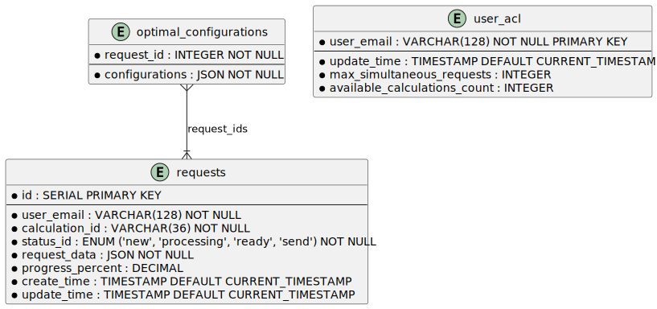
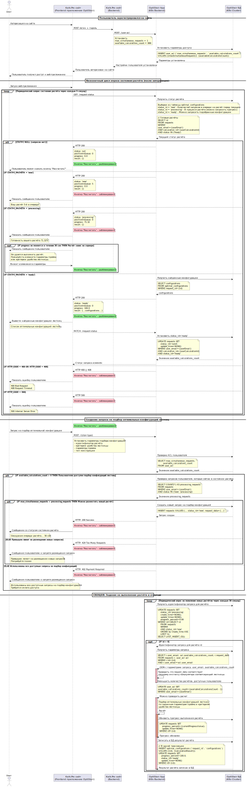

## ADR-004 Отмена "комбинированного" варианта backend-приложения подбора оптимальных конфигураций лестницы (отмена ADR-003)
#### Дата: 2025-03-04
#### Статус: Принято

## Критический сценарий:
* С помощью веб-приложения подбора оптимальной конфигурации лестницы, пользователь получает набор оптимальных конфигураций лестницы в режиме онлайн. На время ожидания подбора пользователь видит прогресс выполнения процесса подбора конфигураций.

## Критические характеристики:
* Время подбора оптимальных конфигураций лестниц для одного проема не более 1 минуты.

### Контекст
Принятое решение в [ADR-003](/docs/adr/adr-003/README.md#adr-003-технологический-стек-backend-веб-приложения-для-фс) содержит ряд минусов:
* Значительное увеличение времени на разработку, так как потребуется разработать не только приложение подбора оптимальных конфигураций, но и дополнительный сервис(ы) для проксирования и транспонирования REST запросов через Web-Socket в контексте ФС Кластера проектных расчетов.
* Неформализованный AsyncApi продиктованный легаси "наследием" проекта.
* Дополнительные затраты на создание и поддержку инфраструктуры в Kubernetes;
* Дополнительные затраты на создание и поддержку новых сервисов в ФС Кластера проектных расчетов;
* Затраты на обучение сотрудников технического сопровождения проекта для работы с инфраструктурой Kubernetes.
* Увеличение количество точек отказа в силу наличия промежуточного слоя в виде сервисов для проксирования и транспонирования REST запросов через Web-Socket в контексте ФС Кластера проектных расчетов.
* Усложнение архитектуры.

Решение в ADR-003 было принято в пользу сохранения совместимости с легаси наследием проекта Kalk.Pro и поддержке двустороннего обмена между веб-приложением и backend-приложением через Web-Socket. Однако, такой подход увеличивает избыточность и сложность архитектурного решение. Приводит к увеличению стоимости проекта за счёт увеличения затрат на разработку и тестирование. Тестирование становится более сложное и непрозрачное, так как все клиентские REST API запросы должны проходить через проксирующие сервисы ФС Кластера проектных расчётов, которые тоже нужно разработать и протестировать.

### Принятое решение
Отменить ADR-003 в пользу ADR-004. Вместо альтернативных решений из ADR-003, в качестве основного варианта для реализации backend-приложения, был выбран подход создания такого приложения на базе сервиса в Kubernetes. Для взаимодействия веб-приложения на стороне frontend с backend-приложением выбран односторонний REST API с периодическим опросом состояния backend-приложения (через каждые 5 секунд) о состоянии запроса на выполнение расчёта оптимальных конфигураций лестниц по заданным параметрам проёма. Отложенное получение результата на 5 секунд, позволяет уложиться в нефункциональны требования - выполнения расчёта за 60 секунд. Основной "точкой" оптимизации является сам подбор конфигураций и возможное ускорение процесса за счёт много-поточности и авто-масштабирования POD-ов штатными средствами Kubernetes. Такой подход позволяет значительно уменьшить количество взаимодействующих систем, упростить архитектурное решение и сэкономить на стоимости решения.

##### Плюсы решения
* Нет ограничений на выбор языка для разработки приложения;
* Возможность автоматического масштабирования приложения под нагрузкой;
* Возможность использование инфраструктурных систем мониторинга, алертинга и логирования (Prometheus, Grafana, Kibana);
* Возможность использование формализованной REST API архитектуры.
* Создание инфраструктуры в Kubernetes для будущего рефакторинга ФС Кластера проектных расчетов: разделение сервисов на "настоящие" микросервисы.
* Простота архитектуры за счёт использования односторонней связи.
* Отсутствие связей с ФС Кластера проектных расчетов.

##### Минусы решения
* Дополнительные затраты на создание и поддержку инфраструктуры в Kubernetes;
* Затраты на обучение сотрудников технического сопровождения проекта для работы с инфраструктурой Kubernetes.

### Архитектурные артефакты
[Спецификация OpenAPI](openapi/optistairs-restapi.yaml)
[Схема БД ФС Подбор оптимальной конфигурации лестницы](/design/diagrams/optistairs-db.puml)

[ДП взаимодействия веб-приложения с backend-приложением, расчёт конфигураций](/design/diagrams/optistairs-calculation-sd.puml)

[ФС Подбор оптимальной конфигурации лестницы](/design/c4/optistair-calc/workspace.dsl)

[Ландшафт программных систем](/design/c4/workspace.dsl)

### Риски
* **Высокий порог входа**: Команде потребуется обучение для работы с Kubernetes
* **Увеличение сложности архитектуры**: Kubernetes добавляет новый уровень абстракции, что может усложнить понимание архитектуры.
* **Несоблюдение НФТ**: возможный выход временного диапазона выделенного на расчёт оптимальных конфигураций, за счёт задержек между итерациями расчёта и опроса состояния запроса на расчёт в силу одностроннего обмена между веб-приложением и backend-приложением.

### Митигация рисков
* Разработать план обучения для команды разработчиков технического сопровождения проекта.
* Создать детальную документацию по настройке и эксплуатации Kubernetes-кластера.
* Подобрать параметры повторов для запуска расчётов на сервере. Увеличение количества инстансов калькуляторов.

[> На главную страницу](/README.md)