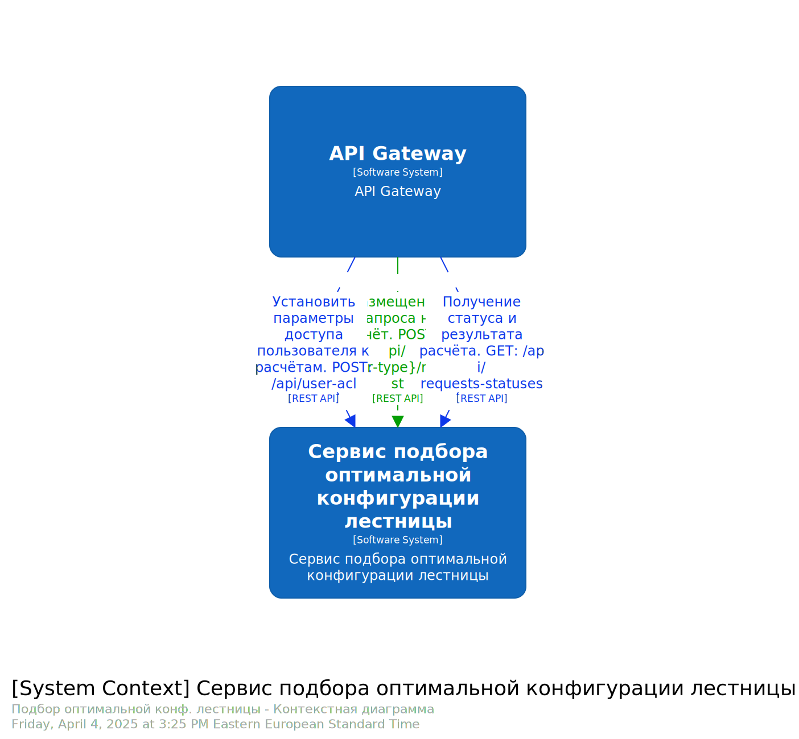
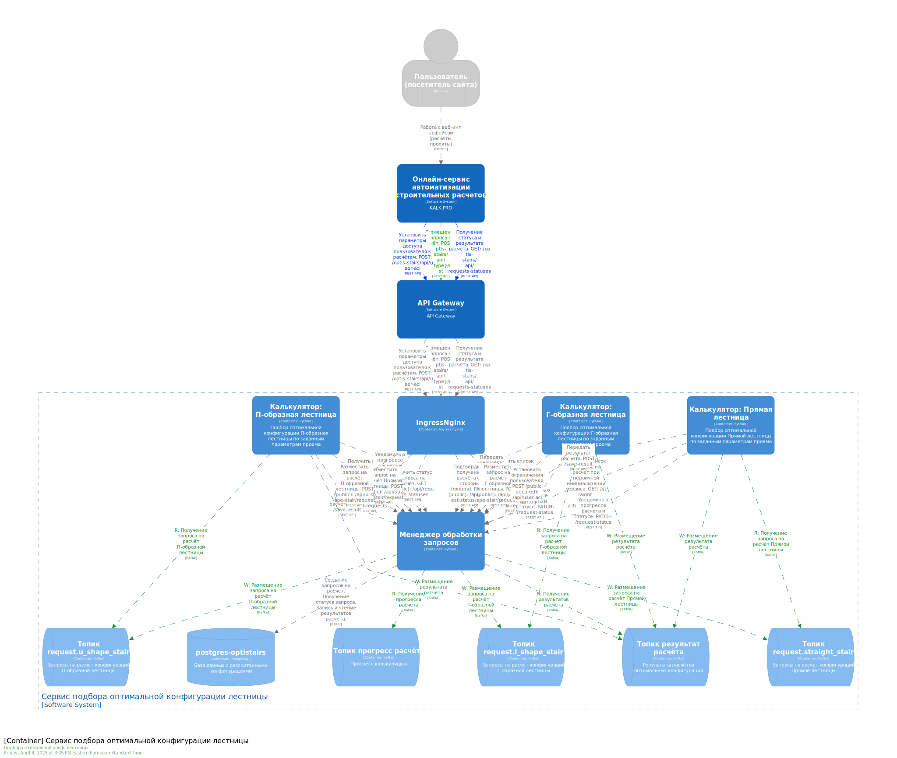
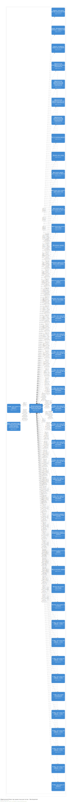
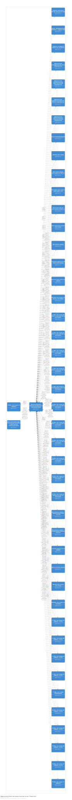
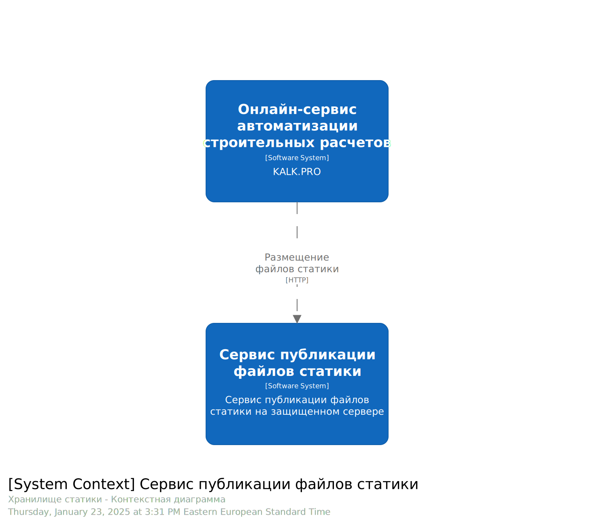

# Системная архитектура C4. Назначение и зона ответственности программных систем.
# Содержание
* [Ландшафт программных систем онлайн-сервиса автоматизации строительных расчетов Kalk.Pro](#ландшафт-программных-систем-онлайн-сервиса-автоматизации-строительных-расчетов-kalkpro)
* [Программная система "Онлайн-сервис Kalk.Pro" (монолит)](#программная-система-онлайн-сервис-kalkpro-монолит)
* [Программная система "Подбор оптимальной конфигурации лестницы" (Функциональный Сервис)](#программная-система-автоматический-подбор-оптимальной-конфигурации-лестницы-функциональный-сервис)
* [Программная система "Кластер проектных расчетов" (Функциональный Сервис)](#программная-система-кластер-проектных-расчетов-функциональный-сервис)
* [Программная система "Сервис простых расчетов"](#программная-система-сервис-простых-расчетов)
* [Программная система "Сервис расчета металлопроката"](#программная-система-сервис-расчета-металлопроката)
* [Программная система "Сервис публикации файлов статики"](#программная-система-сервис-публикации-файлов-статики)

## Ландшафт программных систем онлайн-сервиса автоматизации строительных расчетов Kalk.Pro

## Программная система "Онлайн-сервис Kalk.Pro" (монолит)
### Назначение
Предоставление пользовательского интерфейса к сервисам автоматического расчета типовых строительных конструкций.
### Зоны ответственности
* Хранение учетных данных пользователей, создание и валидация токенов доступа, управление ролями и правами доступа.
* Создание, обновление и удаление информации о пользователе, управление настройками профиля и обработка запросов на получение информации о пользователях.
* Хранение и предоставление информации о доступных продуктах, управление категориями и фильтрами, обработка запросов на поиск.
* Создание, обновление и отслеживание статусов заказов, взаимодействие с платежными системами и сервисами доставки.
* Управление различными способами уведомления (email, SMS, push), обработка предпочтений пользователей и очередей уведомлений.
* Контроль и учёт вознаграждений по партнерской программе сервиса.
* Сбор аналитических данных о пользователях системы.
* Управление расположением и последовательностью отображения баннерных мест.
* Хранение, модерация, отображение комментариев на страницах сайта.
* Хранение, удаление, модификация содержимого страниц сайта.
* Мотивация пользователей на совершение платных операций. Выдача и контроль промо кодов.
* Поиск страниц по заданному содержимому.
* Создания дополнительных данных для поисковой оптимизации сервиса.
* Мониторинг окружения среды пользователя с целью предоставления контента на релевантном языке пользователя.
### L1: Контекст программных систем

### L2: Контейнеры программной системы

### Схема развертывания Dev

### Схема развертывания Stage

### Схема развертывания Prod

## Программная система "Подбор оптимальной конфигурации лестницы" (Функциональный Сервис)
### Назначение
Поиск оптимальных конфигураций лестниц по заданным параметрам проема, в который будет устанавливаться лестница.
### Зона ответственности
Расчет параметров лестницы, сопоставление найденных параметров с критериями удобства для этих параметров, указанные пользователем. Поиск оптимальной конфигурации лестницы среди множества найденных рассчитанных вариантов.  TOBE: Хранение, найденных оптимальных конфигураций лестницы для обеспечения быстрого доступа к ранее рассчитанным конфигурациям.
### L1: Контекст программных систем

### L2: Контейнеры программной системы

### Схема развертывания Dev

### Схема развертывания Prod

## Программная система "Кластер проектных расчетов" (Функциональный Сервис)
### Назначение
Расчет и формирование проектной документации конструкций по заданным параметрам. Предоставление проектной документации в виде списка рассчитанных характеристик конструкции, 3D модель, чертежи.
### Зона ответственности
* Расчет П-обр. лестницы на косоурах (2 марша)
* Расчет П-обр. лестницы на косоурах (3 марша)
* Расчет П-обр. лестницы на косоурах (4 забеж. ступ.)
* Расчет П-обр. лестницы на косоурах (6 забеж. ступ.)
* Расчет П-обр. лестницы на косоурах (8 забеж. ступ.)
* Расчет П-обр. лестницы на косоурах (N забеж. ступ.)
* Расчет Г-обр. лестницы на косоурах (площадка)
* Расчет Г-обр. лестницы на косоурах (2 забеж. ступ.)
* Расчет Г-обр. лестницы на косоурах (3 забеж. ступ.)
* Расчет Г-обр. лестницы на косоурах (4 забеж. ступ.)
* Расчет Г-обр. лестницы на косоурах (N забеж. ступ.)
* Расчет Прямой лестницы на косоурах
* Расчет Прямой лестницы на тетивах
* Расчет Прямой бетонной лестницы
* Расчет Прямой лестницы на метал. косоурах
* Расчет П-обр. лестницы (2 марша) на метал. косоурах
* Расчет П-обр. лестницы (3 марша) на метал. косоурах
* Расчет П-обр. лестницы (4 забеж. ступ.) на метал. косоурах
* Расчет П-обр. лестницы (6 забеж. ступ.) на метал. косоурах
* Расчет П-обр. лестницы (8 забеж. ступ.) на метал. косоурах
* Расчет П-обр. лестницы (N забеж. ступ.) на метал. косоурах
* Расчет Г-обр. лестницы (с площадкой) на метал. косоурах
* Расчет Г-обр. лестницы (2 забеж. ступ.) на метал. косоурах
* Расчет Г-обр. лестницы (3 забеж. ступ.) на метал. косоурах
* Расчет Г-обр. лестницы (4 забеж. ступ.) на метал. косоурах
* Расчет Г-обр. лестницы (N забеж. ступ.) на метал. косоурах
* Расчет Винтовой бетонной лестницы
* Расчет Винтовой метал. лестницы на шесте
* Расчет Винтовой лестницы в пространстве
* Расчет Винтовой дерев. лестницы на шесте
* Расчет Односкатной (плоской) крыша
* Расчет Стропил односкатной (плоской) крыши
* Расчет Двухскатной крыши
* Расчет Стропил двухскатной крыши
* Расчет Вальмовой крыши с изменяемой длиной конька
* Расчет Вальмовой крыши с одинаковым углом скатов
* Расчет Шатровой крыша
* Расчет Деревянных прямоугольных клееных балок перекрытия
* Расчет Деревянных прямоугольных цельных балок перекрытия
* Расчет Деревянных прямоугольных LVL балок перекрытия
* Расчет Деревянных цилиндрических балок перекрытия
* Расчет Ленточного фундамент
* Отправка проектов на email пользователя
* Формирование файлов с проектами
* Версионирование калькуляторов
* Мониторинг жизнеспособности
* Межсервисная маршрутизация запросов внутри "кластера"
* Получение webhook-сообщений и их последующая передача через Web-Sockets
### L1: Контекст программных систем

### L2: Контейнеры программной системы

### Схема развертывания Dev

### Схема развертывания Prod

## Программная система "Сервис простых расчетов"
### Назначение
Предоставление графического интерфейса для создания и управления калькуляторами, которые реализуют автоматизацию простых строительных расчетов не требующих создание проектной документации.
### Зона ответственности
Создание и модификация калькуляторов. Компиляция заложенного функционала и графического представления интерфейса калькулятора в JavaScript-код. Кэширование, управление обновлением, компрессия кода калькуляторов. Отправка кода по запросу через Web-Sockets.
### L1: Контекст программных систем

### L2: Контейнеры программной системы

### Схема развертывания Prod

## Программная система "Сервис расчета металлопроката"
### Назначение
Предоставление графического интерфейса для наполнения и наглядного представления номенклатуры металлопроката и его параметров.
### Зона ответственности
Добавление, редактирование, удаление номенклатуры металлопроката. Предоставление графического интерфейса для автоматизированной работы с параметрами номенклатуры. Расчет весовых и объемных характеристик для выбранной номенклатуры.
### L1: Контекст программных систем

### L2: Контейнеры программной системы

### Схема развертывания Prod

## Программная система "Сервис публикации файлов статики"
### Назначение
Организация дешевого, изолированного хранилища статических файлов.
### Зона ответственности
Хранение статических файлов. Проверка загружаемых файлов на целостность и безопасность. Косвенная защита системы путем предотвращения загрузки пользователем инфицированных статических файлов на сервер с исполняемой средой.
### L1: Контекст программных систем

### L2: Контейнеры программной системы

### Схема развертывания Prod

[> На главную страницу](/README.md)