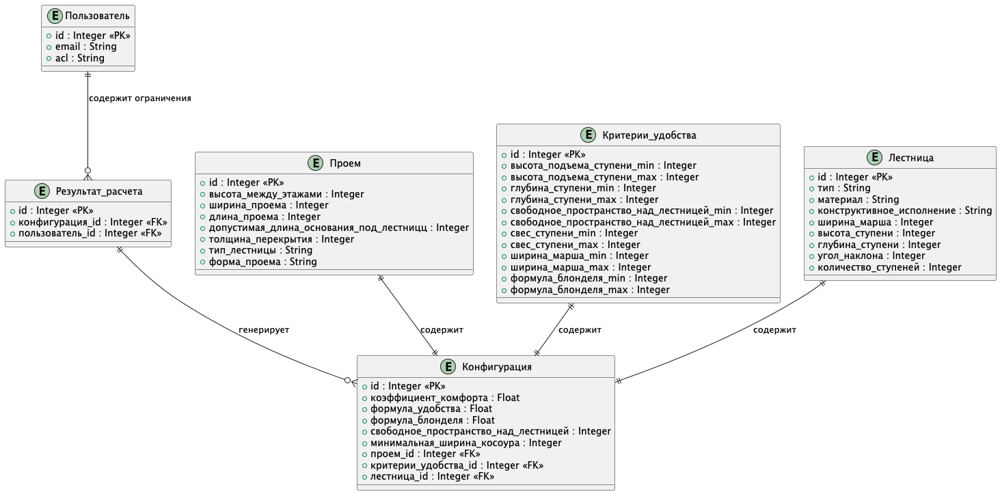

# Декомпозиция ФС Подбор оптимальных конфигураций лестницы
# Содержание
* [Горизонтальная декомпозиция (декомпозиция по слоям)](#горизонтальная-декомпозиция-декомпозиция-по-слоям)
* [Вертикальная декомпозиция (декомпозиция по функциональным областям)](#вертикальная-декомпозиция-декомпозиция-по-функциональным-областям)
* [Сравнительный анализ](#сравнительный-анализ)
* [Функциональная декомпозиция](#функциональная-декомпозиция)
* [Концептуальная архитектура и доменная модель (Archi View)](#концептуальная-архитектура-и-доменная-модель-archi-view)
* [Модель сущностей (Entities model)](#модель-сущностей-entities-model)
* [Модель сущностей (Визуализация)](#модель-сущностей-визуализация)

## Горизонтальная декомпозиция (декомпозиция по слоям)
Система делится на слои или уровни абстракции, где каждый слой отвечает за определённый аспект функциональности.

**Слой пользовательского интерфейса (Frontend)**:
- Отвечает за отображение информации и взаимодействие с пользователем
- Основные компоненты:
    - Ввод параметров проема
    - Настройка критериев удобства
    - Просмотр результатов подбора

**Слой бизнес-логики (Backend)**:
- Реализует основную функциональность подбора конфигураций
- Основные компоненты:
    - Подбор конфигураций
    - Расчет коэффициента комфорта
    - Расчет параметров лестницы
    - Фильтрация результатов
    - Настройки доступа пользователю

**Слой данных**:
- Хранит настройки, параметры и результаты расчетов
- Основные компоненты:
    - Параметры запроса (проем, критерии удобства) на расчет
    - Результаты расчета (оптимальные конфигурации)
      
### Сценарии изменений:
- Добавление новых типов лестниц (вероятность: высокая)
- Изменение алгоритма подбора оптимальных конфигураций (вероятность: средняя)
- Обновление дизайна интерфейса (вероятность: высокая)

### Оценка стоимости изменений:
- Добавление новых типов лестниц: средняя (требует переработки бизнес-логики, возможно в виде отдельного микро-сервиса)
- Изменение алгоритма расчета: средняя (требует переработки бизнес-логики)
- Обновление интерфейса: низкая (не затрагивает другие слои)

## Вертикальная декомпозиция (декомпозиция по функциональным областям)
Система разделяется на функциональные модули или сервисы, каждый из которых отвечает за конкретную бизнес-функцию или сценарий.

**Модуль ввода параметров**:
- Валидация данных
- Интерфейс для выбора параметров проема
- Редактирование критериев удобства
- Сохранение введенных данных

**Модуль расчета конфигураций**:
- Алгоритмы подбора
- Расчет характеристик
- Генерация результатов

**Модуль вывода результатов**:
- Отображение списка конфигураций

**Модуль управления настройками**:
- Управление пользовательским доступом

### Сценарии изменений:
- Добавление новых типов лестниц (вероятность: высокая)
- Изменение алгоритма подбора оптимальных конфигураций (вероятность: средняя)
- Обновление дизайна интерфейса (вероятность: высокая)

### Оценка стоимости изменений:
- Добавление новых типов лестниц: высокая (затрагивает все модули)
- Изменение алгоритма расчета: средняя (требует переработки бизнес-логики)
- Обновление интерфейса: высокая (затрагивает все модули)

## Сравнительный анализ
| Параметр | Горизонтальная декомпозиция | Вертикальная декомпозиция |
|----------|-----------------------------|---------------------------|
| Модифицируемость | Высокая (ясное разделение ответственностей) | Средняя (пересечение функциональностей) |
| Гибкость масштабирования | Высокая (по слоям) | Низкая (требует масштабирования всего модуля) |
| Трудоемкость разработки | Выше (сложная интеграция слоев) | Ниже (простая логика внутри модулей) |
| Поддерживаемость | Выше (отдельные команды по слоям) | Ниже (запутанные зависимости между модулями) |

### Вывод:
Горизонтальная декомпозиция более предпочтительна для данной системы, так как:
1. Предоставляет четкое разделение ответственности между компонентами
2. Обеспечивает лучшую модифицируемость и масштабируемость
3. Упрощает процесс тестирования и поддержки
4. Позволяет использовать существующие практики разработки (например, микросервисы)

Несмотря на более высокую начальную трудоемкость разработки, горизонтальная декомпозиция дает значительные преимущества в долгосрочной перспективе благодаря улучшенной архитектуре и меньшим издержкам на поддержку и модификацию системы.

Данная архитектура лучше соответствует принципам SOLID и позволяет эффективно реагировать на изменения требований, что особенно важно для развивающегося продукта.

## Функциональная декомпозиция
Разбиение системы в соответствии с функциями, которые выполняют отельные сущности системы. Функциональная декомпозиция позволяет определить границы контекста рассматриваемой функциональной области, выделить сущности и их взаимосвязи.

### Функциональные связи:
**Пользователь вводит параметры проема**:
- _Пользователь_ указывает размеры _проема_ (высоту между этажами, ширину и длину проема).
- _Пользователь_ выбирает форму _проема_ (прямоугольный, Г-образный, обратный Г-образный).
- _Пользователь_ указывает толщину междуэтажного перекрытия _проема_.

**Пользователь настраивает критерии удобства лестницы**:
- _Пользователь_ задает предпочтительные значения для высоты подъема ступени, глубины шага, свободного пространства над лестницей, свеса ступени, ширины марша и характеристики по формуле Блонделя.
- Каждый _критерий удобства_ можно изменить в рамках допустимых значений.

**Система выполняет расчет и возварщает реузультаты расчёта**:
- _Система_ валидирует введенные параметры _проема_ и _критерии удобства_.
- Для каждого параметра _система_ рассчитывается коэффициент комфорта - соответствие _критериям удобства_ (от 0 до 1).
- _Система_ фильтрует результаты подбора оптимальных _конфигураций_, исключая из результатов _конфигурации_ с коэффициентом комфорта равным нулю.
- _Система_ сортирует найденные _конфигурации_ по убыванию коэффицента комфорта.
- _Результат расчета_ системы отображается _пользователю_ в виде найденных _конфигураций_ _лестниц_ с их характеристиками (коэффициент удобства, угол наклона, формула удобства, формула Блонделя, высота и глубина ступеней, количество ступеней, ширина лестницы, минимальная ширина косоура).

**Пользователь выбирает оптимальную конфигурацию**:
- _Пользователь_ просматривает список и выбирает наиболее подходящую _конфигурацию_.
- После выбора конфигурации _система_ открывает дополнительную вкладку с онлайн-расчетом выбранной _лестницы_, где _пользователь_ может скачать _проект_ _лестницы_.
- _Пользователь_ получает _проект_ (3D модель, чертежи и технические характеристики) с легаси сервиса Kalk.Pro.

## Концептуальная архитектура и доменная модель (Archi View)

    
## Модель сущностей (Entities model)
#### **Пользователь**
- **Атрибуты**:
  - `id` (уникальный идентификатор)
  - `email`
  - `acl` (max_simultaneous_requests, available_calculations_count)

#### **Проем**
- **Атрибуты**:
  - `id` (уникальный идентификатор)
  - `высота_между_этажами` (мм)
  - `ширина_проема` (мм)
  - `длина_проема` (мм)
  - `допустимая_длина_основания_под_лестницц` (мм)
  - `толщина_перекрытия` (мм)
  - `тип_лестницы` (прямая, Г-образная, П-образная)
  - `форма_проема` (прямоугольный, Г-образный, Г-образный (обратный))

#### **Критерии удобства**
- **Атрибуты**:
  - `id` (уникальный идентификатор)
  - `высота_подъема_ступени_min` (мм)
  - `высота_подъема_ступени_max` (мм)
  - `глубина_ступени_min` (мм)
  - `глубина_ступени_max` (мм)
  - `свободное_пространство_над_лестницей_min` (мм)
  - `свободное_пространство_над_лестницей_max` (мм)
  - `свес_ступени_min` (мм)
  - `свес_ступени_max` (мм)
  - `ширина_марша_min` (мм)
  - `ширина_марша_max` (мм)
  - `формула_блонделя_min` (мм)
  - `формула_блонделя_марша_max` (мм)

#### **Лестница**
- **Атрибуты**:
  - `id` (уникальный идентификатор)
  - `тип` (прямая, Г-образная, П-образная)
  - `материал` (дерево, металл, бетон)
  - `конструктивное_исполнение` (на косоурах, на тетивах, монокосоур и др.)
  - `ширина_марша` (мм)
  - `высота_ступени` (мм)
  - `глубина_ступени` (мм)
  - `угол_наклона` (градусы)
  - `количество_ступеней` (число)

#### **Конфигурация**
- **Атрибуты**:
  - `id` (уникальный идентификатор)
  - `коэффициент_комфорта` (от 0 до 1)
  - `формула_удобства` (численное значение)
  - `формула_блонделя` (численное значение)
  - `свободное_пространство_над_лестницей` (мм)
  - `минимальная_ширина_косоура` (мм)
  - `проем_id` (ссылка на проем)
  - `критерии_удобства_id` (ссылка на критерий удобства)
  - `лестница_id` (ссылка на лестницу)

#### **Результат расчета**
- **Атрибуты**:
  - `id` (уникальный идентификатор)
  - `конфигурация_id` (список ссылок на подобранные конфигурации)
  - `пользователь_id` (ссылка на пользователя)

### Модель сущностей (Визуализация)

[> На главную страницу](/README.md)
