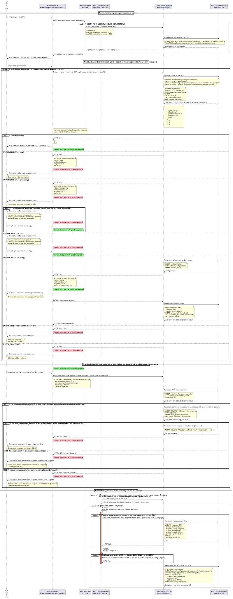

# Оценка атрибутов качества функционального сервиса
# Содержание
* [Горизонтальная декомпозиция (декомпозиция по слоям)](#горизонтальная-декомпозиция-декомпозиция-по-слоям)

## Диаграммы ФС Подбор оптимальной конфигурации лестницы
- [Диаграмма последовательности](/design/diagrams/optistairs-calculation-sd.puml) 

---
- [Схема БД](/design/diagrams/optistairs-db.puml) 

---
- [OpenAPI](/design/openapi/optistairs-restapi.yaml)

## Оценка атрибутов качества системы на основе диаграммы последовательности
### Надежность (Reliability)
**Сценарий**
Пользователь запускает расчет, но сервер не отвечает (HTTP 500).  
**Характеристики системы**
- **Обработка ошибок**
    - Frontend блокирует кнопку "Рассчитать" и показывает сообщение об ошибке (HTTP 500).
    - Если расчет "завис" (прогресс не обновляется 30 сек), пользователю предлагается изменить параметры.
- **Транзакции БД**
    - Обновления состояний расчета в БД в рамках одной транзакции, что гарантирует консистентность данных.
- **Крон-задача**
    - Периодический опрос новых расчетов (каждые 30 сек) снижает риск потери запросов.
    - Автоматический повтор расчетов при временных сбоях.
**Риски**
- Зависимость от стабильности работы крон-задачи (если она "упадет", расчеты не начнутся).
**Рекомендации**
- Использовать очередь сообщений (например, RabbitMQ/Kafka) для размещения и чтения запросов на расчет конфигураций.

### Производительность (Performance)
**Сценарий**
Одновременный запуск расчетов множеством пользователей.  
**Характеристики системы**
- **Опрос состояния расчета**
    - Frontend опрашивает backend каждые 5 секунд. При 1000 активных пользователей это 200 RPS (запросов/сек), что может перегрузить сервер.
- **Крон-задача**
    - Обработка расчетов каждые 5 секунд. Если расчет занимает много времени, и запросов придйте много, очередь будет расти.
- **Ограничения ACL**
    - `max_simultaneous_requests` и `available_calculations_count` предотвращают перегрузку системы со стороны действий отдельного пользователя.
**Рекомендации**
- Увеличить время ожидания между запросами к серверу для получения статуса обработки запроса на подбор конфигураций с 5 до 10-15 секунд.
- Ввести кэширование результатов расчета для заданных параметров проема и критериев удобства.
- Оптимизировать алгоритм расчета: заменить аналитический расчет на матрицу допустимых решений.
- Заменить опрос на WebSocket или Server-Sent Events (SSE) для снижения накладных расходов на создания HTTP соединения.
- Выполнять расчет в параллельных потоках.
- Активировать авто-масштабирование количества вычислительных pod-ов калькуляторов.

### Модифицируемость (Modifiability)
**Сценарий**
Добавление нового типа лестницы (например, винтовая).  
**Характеристики системы**
- **Модульность**
    - Backend (`OptiStair App`) и frontend (`OptiStair Frontend`) разделены. Изменения в алгоритме расчета не затронут интерфейс.
- **База данных**
    - Таблицы `requests` и `optimal_configurations` содержат поле `stair_type`. Добавление нового типа требует минимальных изменений в SQL-запросах.
**Риски**
- Прямые SQL-запросы в коде (например, `INSERT INTO requests`) усложняют рефакторинг.
- Статусы расчетов (`new`, `processing`, `ready`, `send`) "зашиты" в логику. Их замена потребует глобальных изменений.
**Рекомендации**
- Использование ORM вместо прямых обращений в БД.
- Добавить флаги состояния элементов UI для понижения зависимости frontend от бизнес-логики, митигация за счет BFF.

### Масштабируемость (Scalability)
**Сценарий**
Увеличение числа пользователей до 10 000 (моделируемая ситуация, фактически такого количества пользователей не будет).
**Характеристики системы**
- **Горизонтальное масштабирование**
    - Backend (`OptiStair App`) и БД развернуты в Kubernetes, что позволяет масштабировать реплики.
- **Очередь расчетов**
    - Крон-задача обрабатывает запросы последовательно. Для повышения пропускной способности можно добавить worker-ноды.
**Рекомендации**
- Внедрить очередь сообщений (например, RabbitMQ/Kafka) вместо периодического опроса БД.
- Использовать реплики БД для чтения (например, для запросов `SELECT`).

### Безопасность (Security)
**Сценарий**
Атака на API (например, brute force логинов).  
**Характеристики системы**
- **Аутентификация**
    - Пароль передается через POST-запрос (рекомендуется HTTPS).
- **Ограничения ACL**
    - `available_calculations_count` предотвращает исчерпание ресурсов.
    - `max_simultaneous_requests` защищает от DoS-атак.
**Риски**
- Отсутствие rate limiting для запросов `/request-status` (frontend опрашивает каждые 5 сек).
- Потенциальная SQL-инъекция в запросах (например, `WHERE user_email={userEmail}`).
**Рекомендации**
- Использовать очередь сообщений (например, RabbitMQ/Kafka) для обработки запросов `/request-status` вместе с ограничением rate limiting для снижения нагрузки на БД.
- Использовать реплики БД для чтения (например, для запросов `SELECT`).

### Удобство использования (Usability)
**Сценарий**
Пользователь видит, что его расчет 5-й в очереди.  
**Характеристики системы**
- **Обратная связь**
    - Frontend показывает позицию в очереди и прогресс расчета.
    - Кнопка "Рассчитать" блокируется при обработке запроса.
    - Отображение результата запроса после получения результатов расчета.
**Рекомендации**
- Показывать ETA (примерное время ожидания) для улучшения UX. Потребуется добавление дополнительной сущности ФС для хранения и расчета статистической информации о времени расчета схожих конфигураций.

### Поддерживаемость (Maintainability)
**Сценарий**
Исправление ошибки в алгоритме расчета.  
**Характеристики системы**
- **Логирование**
    - В коде отсутствуют явные вызовы логгера (например, при обновлении прогресса).
- **Мониторинг**
    - Крон-задача не возвращает метрик (например, количество обработанных расчетов).
**Рекомендации**
- Добавить логирование ключевых операций (старт/завершение расчета).
- Интегрировать систему мониторинга (Prometheus/Grafana) для отслеживания состояния очереди.
- Добавить сущность ФС для хранения и расчета статистической информации о времени расчета схожих конфигураций.

### Выводы
В целом, система демонстрирует хороший уровень структурированности, но может потребовать доработок в части обработки ошибок, масштабирования и безопасности.

[> На главную страницу](/README.md)